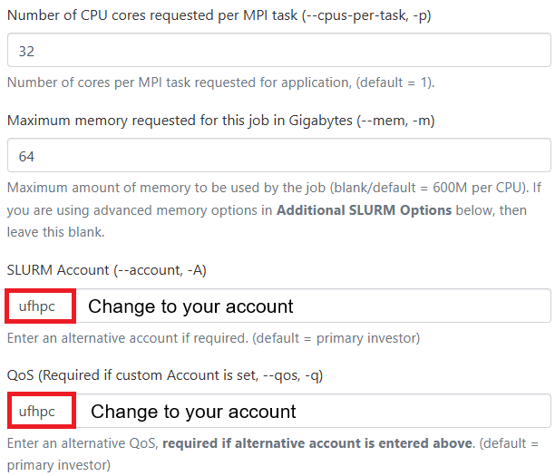

# AlphaFold2-Multimer-NIM
Tutorial to run AlphaFold2-Multimer NIM on HiPerGator

AlphaFold2 is a protein structure prediction model from Google DeepMind. AlphaFold2 demonstrates state-of-the-art performance at predicting protein structure form amino acid sequence, besting all other submissions on the Critical Assessment of protein Structure Prediction (CASP).

## Features

- Predict protein structure given multiple protein sequences.
- Predict a multiple sequence alignments (MSA) for multiple sequences against a series of protein sequence databases.
- Predict a protein structure given a pre-computed MSA of multiple sequences against protein sequence databases.

For more information about AlphaFold2, see the AlphaFold2 paper in Nature. If you use this NIM or AlphaFold2, make sure to cite the paper:
```bash
Jumper, J., Evans, R., Pritzel, A. et al. Highly accurate protein structure prediction with AlphaFold. Nature 596, 583–589 (2021). https://doi.org/10.1038/s41586-021-03819-2
```

## Prerequisites

#### Minimum Requirements:
- **GPU**: One NVIDIA GPU with ≥ 32GB VRAM and Compute Capability ≥ 8.0.
- **RAM**: 64GB.
- **CPU**: At least 24 cores.
- **Storage**: 512GB free SSD space for MSA databases.

#### Recommended for Optimal Performance:
- **GPU**: One NVIDIA GPU with 80GB VRAM (e.g., A100 80GB).
- **RAM**: 128GB.
- **CPU**: At least 36 cores.
- **Storage**: 512GB fast NVMe SSD space.


## Launch MolMIM NIM on HPG

1. Go to [OOD](https://ood.rc.ufl.edu/) and launch the Hipergator Desktop.
  <p align="center">
  
  
  </p>

  **Note**: Remember to update the `SLURM Account` and `QoS` to match your group, and adjust the **job time** accordingly. 
  
2. Start a terminal and run the following commands:
   ```bash
   mkdir -p /blue/groupname/gatorlink/.cache/nim/alphafold2-multimer  # Run only the first time
   export LOCAL_NIM_CACHE=/blue/groupname/gatorlink/.cache/nim/alphafold2-multimer
   mkdir /blue/ufhpc/zhao.qian/.cache/nim/alphafold2-multimer/nvs # Run only the first time
   export MMSEQS_DB_DIR=/blue/ufhpc/zhao.qian/.cache/nim/alphafold2-multimer/nvs
   export MMSEQS_TMP_DIR=/blue/ufhpc/zhao.qian/.cache/nim/alphafold2-multimer/nvs
   ml alphafold2-multimer-nim
   alphafold2-multimer
   start_server
   ```
   **Note**: Since the `AlphaFold2` model is quite large (`612.47 GB`), downloading the model can take up to `2` hours.
   <p align="center">
   
   </p>
   
---

## Running Inference

1. **Open a New Terminal**  
   Keep the original terminal running with the launched service.

2. **Check Service Status**  
   In the new terminal, wait until the health check end point returns `{"status":"ready"}` before proceeding. This may take a couple of minutes. You can use the following command to query the health check.
   ```bash
   curl -X 'GET' \
    'http://localhost:8000/v1/health/ready' \
    -H 'accept: application/json'
   ```
   If you would rather check the NIM’s status via python, you can use the requests module.
   ```python
   import requests

   url = "http://localhost:8000/v1/health/ready"  # Replace with the actual URL

   headers = {
       "content-type": "application/json"
   }
   try:
       response = requests.get(url, headers=headers)

       # Check if the request was successful
       if response.ok:
           print("Request succeeded:", response.json())
       else:
           print("Request failed:", response.status_code, response.text)
   except Exception as E:
       print("Request failed:", E)
   ```
   
4. **Navigate to your DESIRED job running directory**
   ```bash
   cd /blue/groupname/gatorlink/...
   ```
   
5. **Run Inference**  
   Run inference to get a predicted protein structure for an amino acid sequence using the following command.
   ```bash
   curl -X 'POST' \
    'http://localhost:8000/protein-structure/alphafold2/multimer/predict-structure-from-sequences' \
    -H 'accept: application/json' \
    -H 'Content-Type: application/json' \
    -d '{"sequences": ["MNVIDIAIAMAI", "IAMNVIDIAAI"]}' > output.json
   ```
   In python:
   ```python
   import requests
   import json

   url = "http://localhost:8000/protein-structure/alphafold2/multimer/predict-structure-from-sequences"  # Replace with the actual URL.
   sequences = ["MNVIDIAIAMAI", "IAMNVIDIAAI"]  # Replace with the actual sequences you want to perform structure prediction on.

   headers = {
       "content-type": "application/json"
   }

   data = {
       "sequences": sequences,
       "databases": ["uniref90", "small_bfd"]
   }

   response = requests.post(url, headers=headers, data=json.dumps(data))

   # Check if the request was successful
   if response.ok:
       print("Request succeeded:", response.json())
   else:
      print("Request failed:", response.status_code, response.text)
   ```
   
7. **View the Outputs**  
   You can use the cat tool print the outputs to the command line as with the following command.
   ```bash
   cat output.json
   ```
   For better readability, use [jq](https://jqlang.github.io/jq/):
   ```bash
   jq . output.json
   ```
   or you can pipe the output directly to jq as in the following command:
   ```bash
   curl -X 'POST' \
    'http://localhost:8000/protein-structure/alphafold2/multimer/predict-structure-from-sequences' \
    -H 'accept: application/json' \
    -H 'Content-Type: application/json' \
    -d '{"sequences": ["MNVIDIAIAMAI", "IAMNVIDIAAI"]}' | jq
   ```

---

## Endpoints Usage
AlphaFold2-Multimer NIM provides the following endpoints:

- `protein-structure/alphafold2/multimer/predict-structure-from-sequences` - Predict a protein structure given an input list of amino acide sequences.

- `protein-structure/alphafold2/multimer/predict-MSA-from-sequences` - Perform a Multiple Sequence Alignment (MSA) and return the MSA and templates for AlphaFold2 inference. This endpoint is useful for batching long-running and CPU-intensive MSA runs prior to structure prediction.

- `protein-structure/alphafold2/multimer/predict-structure-from-MSA` - Perform structural prediction from an input MSA and templates. This is useful when using a pre-computed or custom/external MSA.
  
### Bash
1. Predict Structure from Multiple Input Sequences (Multimers)
   ```bash
   curl -X 'POST' \
    -i \
    "http://localhost:8000/protein-structure/alphafold2/multimer/predict-structure-from-sequences"  \
    -H 'accept: application/json' \
    -H 'Content-Type: application/json' \
    -d '{"sequences": ["MNVIDIAIAMAI", "IAMNVIDIAAI"], "databases": ["uniref90", "mgnify", "small_bfd"]}'
   ```

2. Predict MSA from Multiple Input Sequences (Multimers)
   ```bash
   curl -X 'POST' \
    -i \
    "http://localhost:8000/protein-structure/alphafold2/multimer/predict-msa-from-sequences"  \
    -H 'accept: application/json' \
    -H 'Content-Type: application/json' \
    -d '{"sequences": ["MNVIDIAIAMAI", "IAMNVIDIAAI"], "databases": ["uniref90", "mgnify", "small_bfd"]}'
   ```
   

### Python Script
1. Predict Structure from Multiple Input Sequences (Multimers), create [predict-structure-from-sequences.py](predict-structure-from-sequences.py).
   ```bash
   python predict-structure-from-sequences.py
   ```

2. Predict MSA from Multiple Input Sequences (Multimers), create [predict-msa-from-sequences.py](predict-msa-from-sequences.py).
   ```bash
   python predict-msa-from-sequences.py
   ```
   
3. Predict Protein Structure from MSAs, create [predict-structure-from-msa.py](predict-structure-from-msa.py).
   ```bash
   python predict-structure-from-msa.py
   ```
   
4. You also can run the python code in Jupyter Notebook
   
   In the terminal and run the command:
   ```bash
   ml python
   jupyter lab
   ```
   After launching JupyterLab, ensure you select the 'python3' kernel before running the notebooks [Inference Endpoints.ipynb](Inference_Endpoints.ipynb). 

## Stopping the NIM Service

To stop the NIM service, simply close the terminal window.

### Important Note
Since downloading the AlphaFold2 model can take a very long time and won't affect your next run, you do not need to clean your cache folder. 

---

## Another way to run MolMIM NIM on HPG

1. **Submit a SLURM batch job**  
   Use `sbatch` to start the NIM server with GPU resources, and record the name of the node where the server is running.

2. **Open a terminal or Jupyter session**  
   Start an SSH terminal or a Jupyter session using any preferred method (e.g., Open OnDemand, `srun`, etc.), with minimal resource allocation (no GPU required) to run inference.

3. **Run on the same node**  
   Ensure that the SSH terminal or Jupyter session for inference runs on the same node as the server.

---

## References

- [AlphaFold2-Multimer Documentation](https://docs.nvidia.com/nim/bionemo/alphafold2-multimer/latest/index.html)
- [AlphaFold2-Multimer on NVIDIA NGC](https://catalog.ngc.nvidia.com/orgs/nim/teams/deepmind/containers/alphafold2-multimer)
